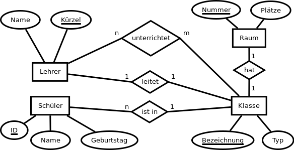

[[../../README.md | < Zur Übersicht]]

## Wenn du von dem ganzen Data Modelling nicht genug bekommen kannst, ändere das ERD des Schul-Beispiels aus dem Unterricht so ab, dass es zusätzlich die Entität `Fach` gibt. Außerdem sollen erine unbestimmte Zahl an Zusatzämtern (Medienwart, Strahlenschutzbeauftragter, etc.) für jeden Jahren gespeichert werden, sodass auch auf historische Daten für diese Ämter zugänglich sind – also z. B. die Frage: "In welchem Jahr war welcher Lehrer Medienwart?". Diese Übung ist rein optional, kann also übersprungen werden (gibt dann aber keinen Punkt).

# Stand bisher

<table>
  <tr>
    <th colspan="3">Schüler</th>
  </tr>
  <tr>
    <td>id</td>
    <td>INT</td>
    <td>PRIMARY KEY AUTOINCREMENT</td>
  </tr>
   <tr>
    <td>Name</td>
    <td>VARCHAR</td>
    <td>NOT NULL</td>
  </tr>
   <tr>
    <td>Geburtstag</td>
    <td>DATETIME</td>
    <td></td>
  </tr>
  <tr>
    <td>Klasse_id</td>
    <td>INT</td>
    <td>FOREIGN KEY (Klasse)</td>
  </tr>
</table>

<table>
  <tr>
    <th colspan="3">Lehrer</th>
  </tr>
  <tr>
    <td>id</td>
    <td>INT</td>
    <td>PRIMARY KEY AUTOINCREMENT</td>
  </tr>
   <tr>
    <td>Name</td>
    <td>VARCHAR</td>
    <td>NOT NULL</td>
  </tr>
   <tr>
    <td>Kürzel</td>
    <td>VARCHAR</td>
    <td>UNIQUE</td>
  </tr>
</table>
Die Klassenleitung wird in der Klasse gespeichert, da dort mehr Anfragen dazu erwartbar sind.

<table>
  <tr>
    <th colspan="3">Klasse</th>
  </tr>
  <tr>
    <td>id</td>
    <td>INT</td>
    <td>PRIMARY KEY AUTOINCREMENT</td>
  </tr>
   <tr>
    <td>Bezeichnung</td>
    <td>VARCHAR</td>
    <td>NOT NULL UNIQUE</td>
  </tr>
   <tr>
    <td>Typ</td>
    <td>VARCHAR</td>
    <td></td>
  </tr>
     <tr>
  <td>Klassenleiter_id</td>
    <td>INT</td>
    <td>FOREIGN KEY (Lehrer)</td>
  </tr>
   <td>Raum_id</td>
    <td>INT</td>
    <td>FOREIGN KEY (Raum)</td>
  </tr>
</table>

<table>
  <tr>
    <th colspan="3">Raum</th>
  </tr>
  <tr>
    <td>id</td>
    <td>INT</td>
    <td>PRIMARY KEY AUTOINCREMENT</td>
  </tr>
   <tr>
    <td>Raumnummer</td>
    <td>VARCHAR</td>
    <td>NOT NULL UNIQUE</td>
  </t r>
   <tr>
    <td>Plätze</td>
    <td>INT</td>
    <td></td>
  </tr>
</table>

<table>
  <tr>
    <th colspan="3">KlasseLehrerUnterricht</th>
  </tr>
  <tr>
    <td>Lehrer_id</td>
    <td>INT</td>
    <td>FOREIGN KEY (Lehrer)</td>
  </tr>
    <tr>
    <td>Klasse_id</td>
    <td>INT</td>
    <td>FOREIGN KEY (Klasse)</td>
  </tr>
</table>

# Stand mit Schuljahren